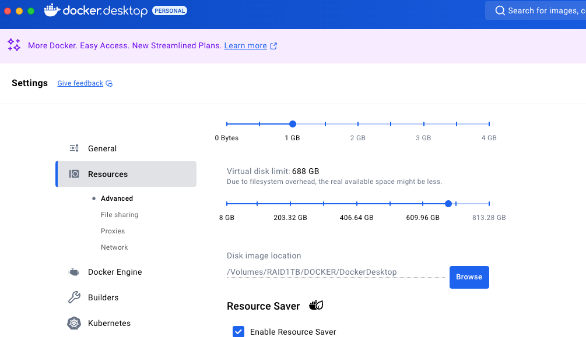

# web Odm
## Getting started with NodeODM

#### Creating folders to store WebODM data
data
```commandline
sudo mkdir -p /mnt/nvme1/docker-data/webodm-data
sudo chmod -R 770 /mnt/nvme1/docker-data/webodm-data
sudo chown -R root:docker /mnt/nvme1/docker-data/webodm-data
```

db
```commandline
sudo mkdir -p /mnt/nvme1/docker-data/webodm-db
sudo chmod -R 770 /mnt/nvme1/docker-data/webodm-db
sudo chown -R root:docker /mnt/nvme1/docker-data/webodm-db
```

#### prepare the WebODM    
```commandline
sudo docker run -d --restart unless-stopped \
  -p 8000:8000 \
  -v /mnt/nvme1/docker-data/webodm-data:/var/www/data \
  -v /mnt/nvme1/docker-data/webodm-db:/webodm/app/db \
  opendronemap/webodm_webapp


```
####

#### check the image
```
(base) cristianku@localhost:~$ docker ps
CONTAINER ID   IMAGE                      COMMAND                  CREATED              STATUS                          PORTS     NAMES
81ab73f336e7   opendronemap/nodeodm:gpu   "/usr/bin/node /var/…"   About a minute ago   Restarting (1) 23 seconds ago             gracious_bardeen
```

### WEBODM ( web interface on the Desktop Computer)
#### Install docker desktop for your OS, in my case MacOs
https://docs.docker.com/desktop/setup/install/mac-install/

#### You can define a specific folder for the export



```commandline
git clone https://github.com/OpenDroneMap/WebODM --config core.autocrlf=input --depth 1
cd WebODM
./webodm.sh start
```

#### Now you can access your WebODM:
```commandline
http://localhost:8000

```


#### Now we add the remote processing node

