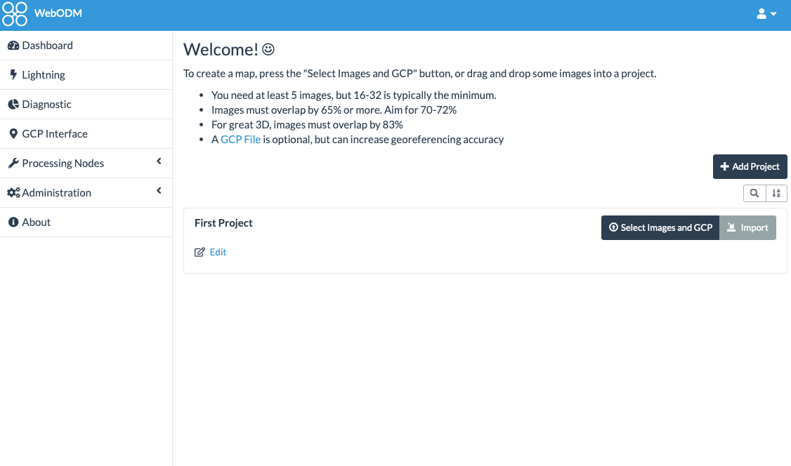
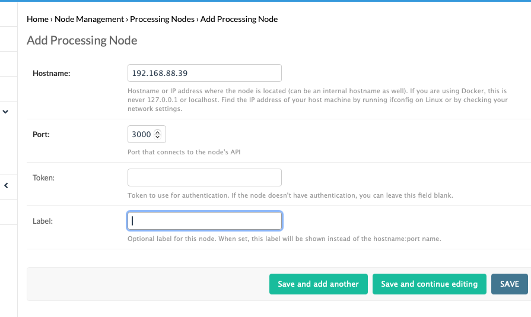

# Getting started with WebODM

#### Creating folders to store WebODM data
```commandline
sudo mkdir -p /mnt/nvme1/docker/docker-app-data
sudo chmod -R 770 /mnt/nvme1/docker/docker-app-data
sudo chown -R root:docker /mnt/nvme1/docker/docker-app-data
```

```commandline
sudo mkdir -p /mnt/nvme1/docker/docker-app-data/webodm-data
sudo chmod -R 770 /mnt/nvme1/docker/docker-app-data/webodm-data
sudo chown -R root:docker /mnt/nvme1/docker/docker-app-data/webodm-data
```

db
```commandline
sudo mkdir -p /mnt/nvme1/docker/docker-app-data/webodm-db
sudo chmod -R 770 /mnt/nvme1/docker/docker-app-data/webodm-db
sudo chown -R root:docker /mnt/nvme1/docker/docker-app-data/webodm-db
```

```commandline
git clone https://github.com/OpenDroneMap/WebODM --config core.autocrlf=input --depth 1
```
create a script to be able to specify you custom folders
```yaml
vi ~/start_WebODM.sh
```
add the following
```yaml
#!/bin/bash
cd WebODM
sudo ./webodm.sh restart --media-dir /mnt/nvme1/docker-data/webodm-data --db-dir /mnt/nvme1/docker-data/webodm-db
```

start the script
```yaml
sudo ./start_WebODM.sh
```

#### Now you can access your WebODM:
```commandline
http://localhost:8000

```


#### Now we add the remote processing node




